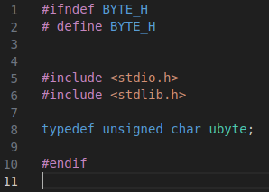

# guardef
### A bash script to automatically add include guards in your .h files (because I also forget them).

### __What does it do ?__
- Automatically add includes guards to (specfied) .h files. Basiscally,

```c
#ifndef FILENAME_H
#define FILENAME_H

#endif
```
in every file, conserving your code too (as it was written.)

### __Requirements__

- dos2unix : you can get it by typing 
```ps
sudo apt install dos2unix
```
in a terminal.

- Something that can execute .sh files. Your terminal will work just fine.

### __How to install it on your computer__ ?

- Just git clone it using : 
```ps
git clone https://github.com/Esteban795/guardef.git
```
### __How to use it__ ?

- Go to the cloned directory and enter
```
./guardef.sh [path to your files]
```
in your terminal.

- As an example, after running the command on the `tests/byte.h` file, you should get :

